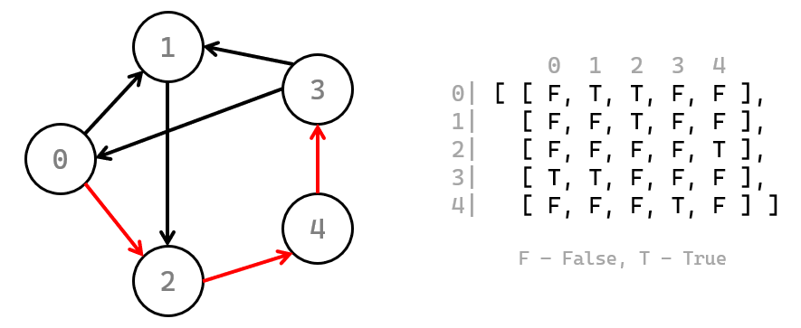

# Task A (graph search)
Your task is to complete a Python code in file `a.py`, by completing the function scaffolding
that is provided in the file. Description of what the function accepts and should return can be
found further in this document.

## Problem description
For this task, you are going to implement graph search using the Breadth-First Search (BFS)
algorithm. But worry not! Since this is not Algorithms and Data Structures course, you will
be provided a description of how this algorithm works (which is below).

For this task, you get a directed graph, expressed as an incidence matrix, and a destination
node index. Your goal is to calculate how long is the path between node `0` and the target node.

The starting point will always be the node with index `0`. Please note, that we are interested
in the length of the shortest path between the nodes (which is what BFS results in). Let's
assume that all edges have length equal to 1.

You are guaranteed that there's always at least one path from starting to the target node.

The function you're going to complete has the following signature:

```py
getDistance(graph, destNode)
```

The first argument, `graph` is a two-dimensional array (array of arrays) of booleans: value
at `graph[i][j]` tells whether there's an edge from node `i` to node `j`. The second argument,
`destNode` is the index of the node we are going to reach.

The function should return a single integer, representing the distance between node `0` and
the target one. Assuming the target is `3`, the anticipated behavior can be seen on the image below.



The graph on the left is represented by the Python array on the right. For your convenience,
the row and column indices are included and the values are abbreviated to `T` (meaning `True`)
and `F` (meaning `False`). In the actual code you'll get proper booleans.

The shortest path from `0` to `3` is marked in red and has a length of 3. Please note that this is
not the only path between those two nodes, but is indeed the shortest. Therefore, the result of
the function should be the number `3`.

## Testing
We have prepared a set of test cases to assure that your solution works fine. You can launch the
testing code as often as you wish, by running the `test.py` file (e.g. by typing in terminal
`python test.py`).

Performance of your solution is not taken into account.

## Description of Breadth-First Search
**Data**:
  - a queue of nodes to visit: `queue`
  - the node to start from: `srcNode` (which is `0` in our case)
  - the node to finish at: `destNode`

The `queue` will contain pairs, of which the first element will be a node index and a second –
distance to that node from the source node.

**Algorithm**:
1. Initialize the `queue` to contain a tuple `(srcNode, 0)`.
2. As long as there is anything in the `queue`:
    - read the pair `(node, dist)`, which is the first item in the `queue`,
    - remove that pair from the `queue`,
    - if `node` equals `destNode`, return `dist`,
    - iterate over all nodes `n` that can be reached from `node`,
    - for every such node, append a pair `(n, dist+1)` to the `queue`.
