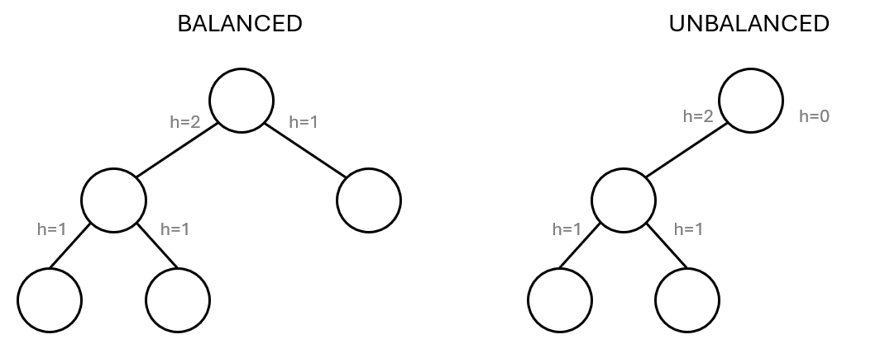
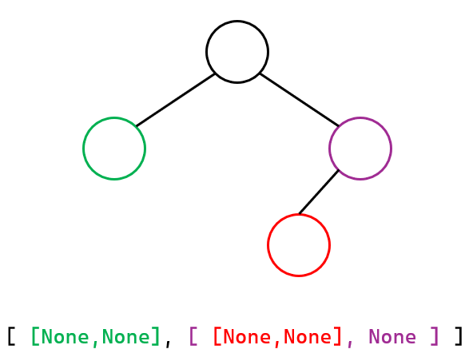

# Task B (tree balance)
Your task is to complete a Python code in file `b.py`, by completing the function scaffolding
that is provided in the file. Description of what the function accepts and should return can be
found further in this document.

## Problem description
For this task, you're going to implement a function checking whether a given binary tree
is balanced or not. A tree is considered balanced if, for every node, the difference of
heights between its left and right subtree is not more than 1.

A tree can be balanced only if all of its subtrees are also balanced.

We assume that empty (sub)tree (i.e. with no nodes at all) has height of 0 and a (sub)tree
with only a single node has a height of 1.



The function you're going to complete has the following signature:

```py
isBalanced(tree)
```

It accepts a single argument, the tree to check, and should return a boolean value: `True` if
the tree is balanced and `False` if it's not.

Since for this task, we are not interested in any values that might be associated with the tree,
the nodes will contain only information about their children. A single node is an array of two
elements, which in turn may be arrays. If there's no left or right subtree, the corresponding
element of the array will be `None`.

```py
[ leftSubtree, rightSubtree ]
```

The image below shows representation of a sample tree. For your convenience, code and its
corresponsing nodes have been marked using the same colors.



## Testing
We have prepared a set of test cases to assure that your solution works fine. You can launch the
testing code as often as you wish, by running the `test.py` file (e.g. by typing in terminal
`pytest test.py`).

Performance of your solution is not taken into account.

If you don't have `pytest` installed on your computer, run command `pip install pytest` in order
to install it.

## Description of balance check algorithm
### Height calculation
For this algorithm, we will need an additional helper function that measures the tree height.
It is a recursive algorithm which accepts a single parameter – the `tree` node (in form of a
two-element array or None) – and works as follows:
1. If the `tree` is equal to `None`, return `0`.
2. Let `hL` be the height of the left subtree of `tree`.
3. Let `hR` be the height of the right subtree of `tree`.
4. Return the greater value of the two: (`hL`, `hR`), increased by `1`.

### Actual balance check
This is a recursive algorithm that accepts a single parameter, the `tree` and works as follows:
1. If the `tree` is equal to `None`, return `True`.
2. Recursively check if the left subtree is balanced. If not, return `False`.
3. Recursively check if the right subtree is balanced. If not, return `False`.
4. Let `hL` be the height of the left subtree of `tree`.
5. Let `hR` be the height of the right subtree of `tree`.
6. Return `True` if `-1 <= hL - hR <= 1`; else return `False`.
